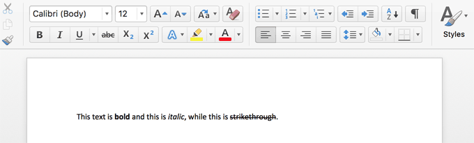
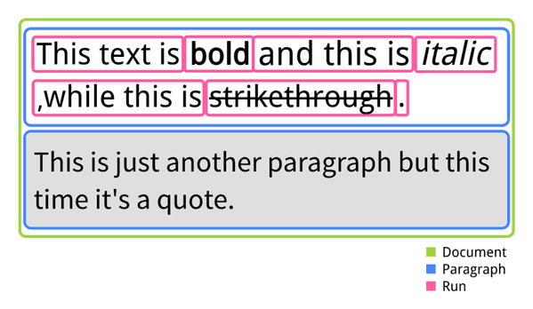

## Introducing a way to transform Markdown to a Word document

The purpose of this post is to show a way to transform Markdown
to a Word document using frameworks like [Apache POI](https://poi.apache.org/document/),
[JSoup](https://jsoup.org/) and [Pegdown](https://github.com/sirthias/pegdown).
This blogpost will cover a simple example where a piece of Markdown is transformed into a Word document.
In this simple example I will show how simple Markdown - formatting like **bold**, *italic* and ~~strikethrough~~ - can be transformed into a Word document which typically has the filename extension: `docx`.

## Markdown and Word documents

If you never faced Markdown before, you can read everything about it at [Daring Fireball](https://daringfireball.net/projects/markdown/).
To keep it short, Markdown is a markup language created for fast, easy formatting of text *on the fly*.
Markdown lets the author format his text while writing it.
So this:

`
This text is **bold** and this is *italic*, while this is ~~strikethrough~~.
`

becomes:

>This text is **bold** and this is *italic*, while this is ~~strikethrough~~.

As you might know, in Microsoft Word formatting text like this have extra buttons in menus.

## Why transform Markdown to a Word document?

In a workflow management system like [Signavio Workflow](http://www.signavio.com/products/workflow/) we face the frontier of digital and non-digital age quite often.
As we try to do everything digitally, Markdown is our best friend when it comes to formatting text online, especially in a workflow management system.
However in everyday life we are working with a lot of non-techy people who love using office products like the office suites provided by Microsoft and Google.
Sometimes these two worlds collide and in the event of clashing there should be a solution suitable for both worlds, leading directly into a Markdown to docx transformer.

## Transform simple Markdown text to a Word document

As mentioned in the introduction, the goal of this article should be to transform this:

`
This text is **bold** and this is *italic*, while this is ~~strikethrough~~.
`

into this:



We need to take three steps from Markdown to docx:

1. Parse the Markdown and create HTML
2. Parse the HTML
3. Create a document from parsed HTML

Luckily the first two steps can quickly be done by using existing libraries.
I used [Pegdown](https://github.com/sirthias/pegdown) for step 1 and [JSoup](https://jsoup.org/) for step 2.
There is not really anything special to mention for these steps, so I will focus on explaining the structure of the outcome and how to use [Apache POI](https://poi.apache.org/document/).

Libraries like Pegdown will create HTML like this:

```html
<p>This text is <strong>bold</strong> and this is <em>italic</em>,
while this is <del>strikethrough</del>.</p>
```

Parsing this piece of HTML will result in a tree like this:
```
/
├─ HTML
   └─ HEAD
   |  └─ #text
   └─ BODY
      ├─ #text
      └─ P
         ├─ #text: This text is
         ├─ STRONG
         |  └─ #text: bold
         ├─ #text: and this is
         ├─ EM
         |  └─ #text: italic
         ├─ #text: , while this is
         ├─ DEL
         |  └─ #text: strikethrough
         └─ #text: .
```
As we got this far, we are ready to use Apache POI to create a docx document, but first let’s have a look at the structure of a docx document as used by POI for this simple example.

### Generating a Word document
A document contains multiple paragraphs which can contain multiple runs. A paragraph defines the styling of one part of the document.
A good example might be a quote, which might have a grey background to outline the quote visually but also basic text is separated in paragraphs.

A run is defined by the same styling of words.
In the example mentioned earlier, the complete sentence is one paragraph (in the HTML part, this is marked by the `<p>` tag), while styling applied to the text itself becomes a run.
So one could say a run is a group of words which have the same styling.
The following scheme shows what I just described:



This scheme leads to the following code which covers generating HTML from the Markdown and then parsing the generated HTML:

```java
public class DocxTransformer {

   public XWPFDocument transformMarkdownToDocx(String markdown) throws DocumentException {
     XWPFDocument document = new XWPFDocument();
     String markdownToHtml = new PegDownProcessor.markdownToHtml(markdown); // step 1
     Elements body = parseHtmlAndGetBody(markdownToHtml); // step 2
     Document html = Jsoup.parse(markdownToHtml);
     Elements body = html.getElementsByTag("body");
     return writeDocument(body, document); // step 3
  }

  private XWPFDocument writeDocument(Elements body, XWPFDocument document) {
    // actual implementation
  }
}
```

### Transforming HTML to Word

From this point on there are different approaches to follow.
One way is to go through the tree by recursively calling a method which identifies every node and does something with the identified result.
Another one would be to follow the [visitor pattern](https://en.wikipedia.org/wiki/Visitor_pattern).
Whatever approach you prefer, at some point you will need to create _paragraphs_ and _runs_ which can be done like this:

```java
 private XWPFDocument writeParagraphContent(Element paragraphNode, XWPFDocument document) {
  // find the paragraph node
  XWPFParagraph paragraph = document.createParagraph();
  paragraph.setStyle("BodyText"); //set styling, this could be any predefined style
  // find child nodes
  paragraphNode.childNodes().forEach(child -> evaluateNode(child, paragraph, null));
  // add more stuff to document
 }

 private void evaluateNode(Node child, XWPFParagraph paragraph, XWPFRun run) {
  if (run == null) {
   XWPFRun run = paragraph.createRun();
  }
  if (nodeIsNotText(child)) {
   switch (child.getTagName()) {
    case "strong":
     run.setBold(true);
     break;
    case "em":
     run.setItalic(true);
     break;
    case "del":
     run.setStrikethrough(true);
     break;
   }
   child.forEach(node -> evaluateNode(node, paragraph, run));
  } else {
   run.text(unEscapeHTML(childElement.toString()))
  }
 }
```

This code creates a paragraph and passes it to the `evaluateNode` method which passes every child. A child can be a `Node` or an `Element` which are the JSoup API types for the HTML nodes. An HTML node is either an HTML tag, or text content.
Every time there is styling, it is added to the current run until the method faces a text node.
At this point it sets the text to the run.
Since there are methods for creating a paragraph and a run on its parent, there is no need to set the paragraph/run directly on the document.

## Conclusion

The approach I showed in this article is a basic setup for creating Word documents.
It shows how to transform formatted text.
But of course there is more.

There are a lot of things that Markdown can do which I did not even mention, like creating lists or tables.
But tables, lists and basic formatted text have one thing in common: the approach stays the same.
First parse the Markdown and create HTML from it, then take this HTML and build a tree which is the basis for creating the Word document.

The downside of the approach shown is that the code used to parse through all nodes of the tree is kind of ugly because I always need to check if the element passed is a tag or a text node. The reason for that is that it might not be the best solution to use HTML as an intermediate format.
